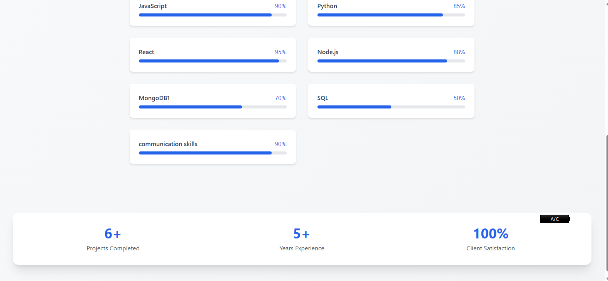
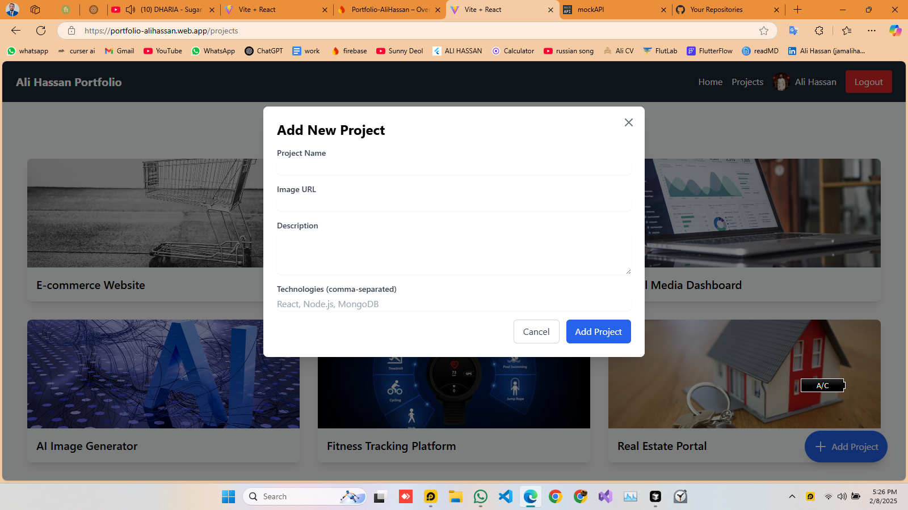
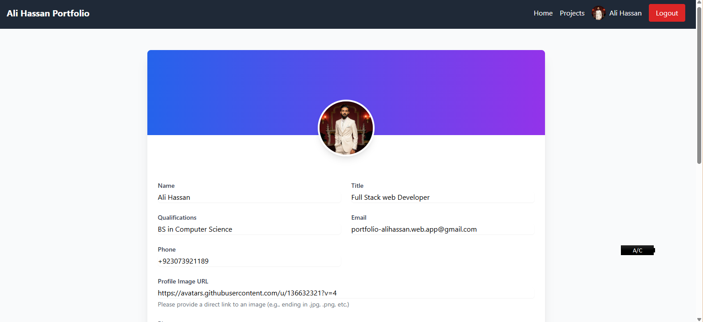
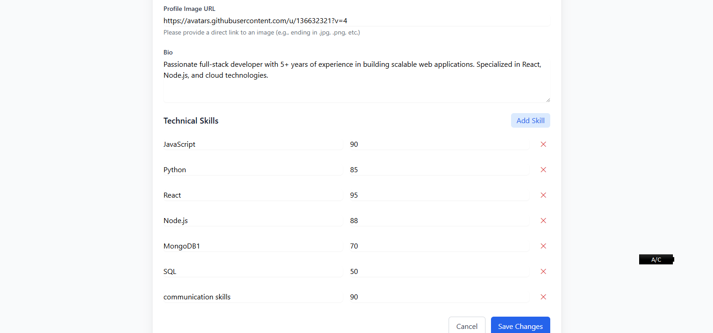
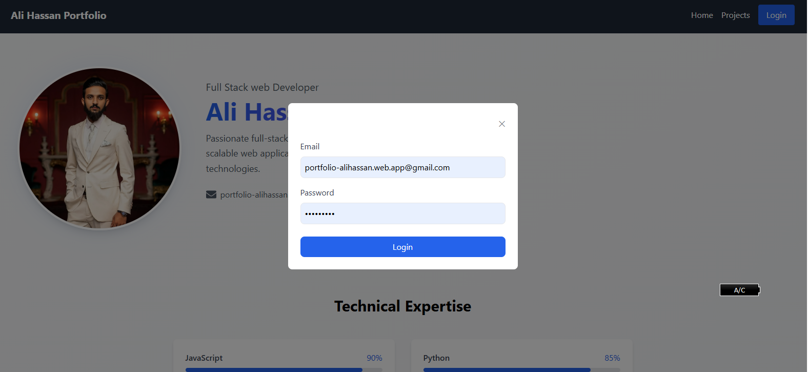

# Ali Hassan Portfolio

A modern, responsive portfolio website built with React and Firebase.

## 🔴 Live Demo

Check out the live demo: [https://portfolio-alihassan.web.app](https://portfolio-alihassan.web.app)

## 📸 Screenshots

### Home Page


_Hero Section with Profile Overview_


_Skills and Technical Expertise Section_

### Projects Section


_Projects Grid View_


_Project Details Modal_


_Add New Project Interface_


_Projects Overview_

### Profile Dashboard


_User Profile Overview_



_Profile Edit Interface_

### Authentication


_User Login Interface_

## 🚀 Features

- Responsive Design
- Modern UI/UX
- Project Showcase
- Skills Display
- Contact Information
- Admin Dashboard
- Authentication System
- Project Management

## 🛠️ Built With

- React.js
- Vite
- Firebase
- Tailwind CSS
- React Router DOM
- React Icons
- React Hot Toast

## 🚀 Deployment

1. Build the project

```bash
npm run build
```

2. Deploy to Firebase

```bash
firebase deploy
```

## 🤝 Contributing

Contributions, issues, and feature requests are welcome!

1. Fork the Project
2. Create your Feature Branch (`git checkout -b feature/AmazingFeature`)
3. Commit your Changes (`git commit -m 'Add some AmazingFeature'`)
4. Push to the Branch (`git push origin feature/AmazingFeature`)
5. Open a Pull Request

## 📝 License

This project is [MIT](./LICENSE) licensed.

## 🙏 Acknowledgments

- [React](https://reactjs.org/)
- [Vite](https://vitejs.dev/)
- [Firebase](https://firebase.google.com/)
- [Tailwind CSS](https://tailwindcss.com/)
