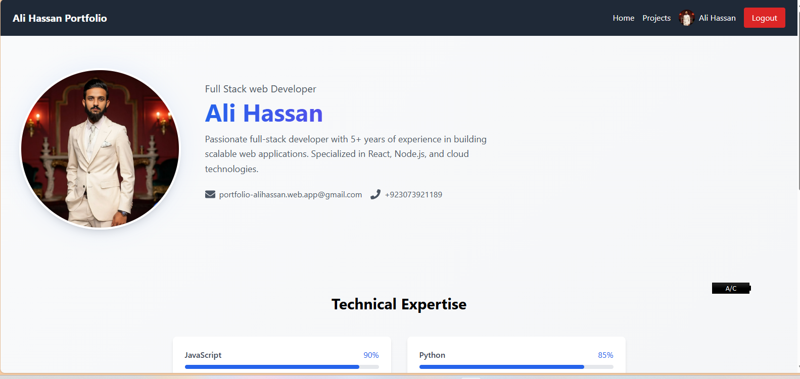

      <h1>  Portfolio</h1>
     

    

# Tech Used
      
      

A modern, responsive portfolio website built with React and Firebase.

## 🔴 Live Demo

Check out the live demo: [https://portfolio-alihassan.web.app](https://portfolio-alihassan.web.app)

## 📸 Screenshots

### Home Page

_Hero Section with Profile Overview_

_Skills and Technical Expertise Section_

### Projects Section

_Projects Grid View_

_Project Details Modal_

_Add New Project Interface_

_Projects Overview_

### Profile Dashboard

_User Profile Overview_

_Profile Edit Interface_

### Authentication

_User Login Interface_

## 🚀 Features

- Responsive Design
- Modern UI/UX
- Project Showcase
- Skills Display
- Contact Information
- Admin Dashboard
- Authentication System
- Project Management

## 🛠️ Built With

- React.js
- Vite
- Firebase
- Tailwind CSS
- React Router DOM
- React Icons
- React Hot Toast

## 🙏 Acknowledgments

- [React](https://reactjs.org/)
- [Vite](https://vitejs.dev/)
- [Firebase](https://firebase.google.com/)
- [Tailwind CSS](https://tailwindcss.com/)
