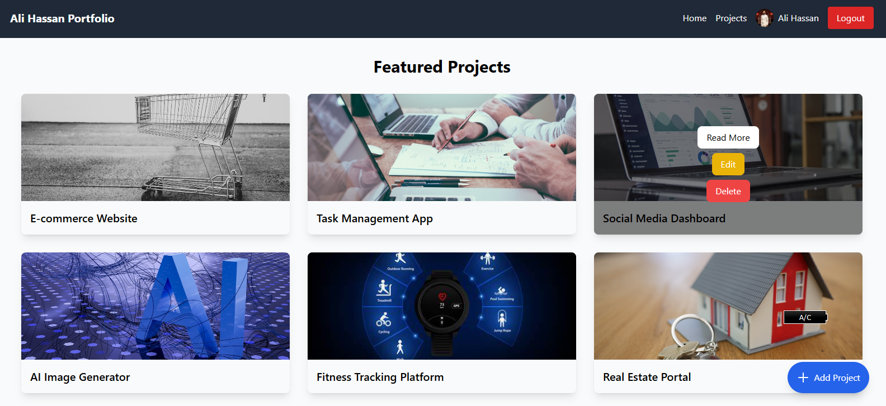
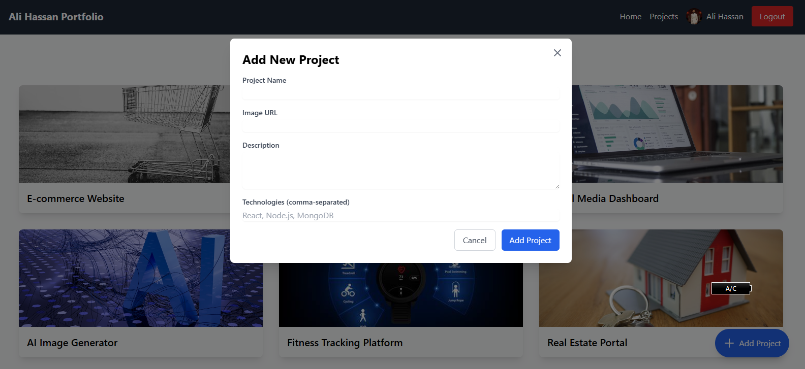
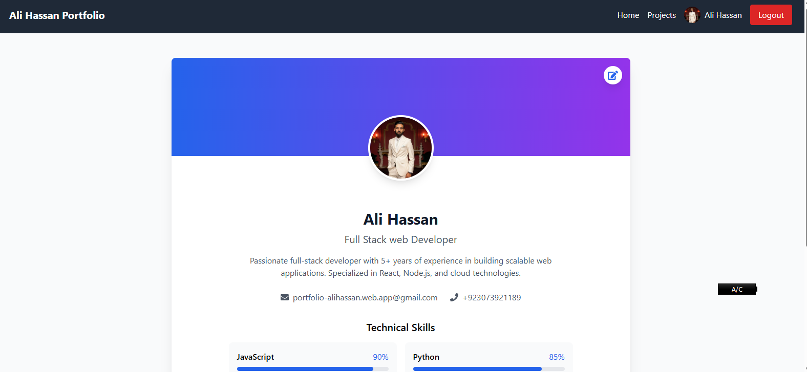

# Ali Hassan Portfolio

A modern, responsive portfolio website built with React and Firebase.

## 🔴 Live Demo

Check out the live demo: [https://portfolio-alihassan.web.app](https://portfolio-alihassan.web.app)

## 📸 Screenshots

### Home Page


_Hero Section with Profile Overview_


_Skills and Technical Expertise Section_

### Projects Section


_Projects Grid View_


_Project Details Modal_


_Add New Project Interface_


_Projects Overview_

### Profile Dashboard



_User Profile Overview_


_Profile Edit Interface_

### Authentication


_User Login Interface_

### Responsive Design

<div align="center">
  
  
</div>
*Mobile-Responsive Views*

## 🚀 Features

- Responsive Design
- Modern UI/UX
- Project Showcase
- Skills Display
- Contact Information
- Admin Dashboard
- Authentication System
- Project Management

## 🛠️ Built With

- React.js
- Vite
- Firebase
- Tailwind CSS
- React Router DOM
- React Icons
- React Hot Toast

## 📝 Prerequisites

Before you begin, ensure you have met the following requirements:

- Node.js (v18.x or higher)
- npm (v10.x or higher)

## ⚙️ Installation

1. Clone the repository

```bash
git clone https://github.com/your-username/your-portfolio.git
```

2. Install dependencies

```bash
npm install
```

3. Create a `.env` file in the root directory and add your Firebase configuration

```env
VITE_FIREBASE_API_KEY=your-api-key
VITE_FIREBASE_AUTH_DOMAIN=your-auth-domain
VITE_FIREBASE_PROJECT_ID=your-project-id
VITE_FIREBASE_STORAGE_BUCKET=your-storage-bucket
VITE_FIREBASE_MESSAGING_SENDER_ID=your-messaging-sender-id
VITE_FIREBASE_APP_ID=your-app-id
```

4. Start the development server

```bash
npm run dev
```

## 🚀 Deployment

1. Build the project

```bash
npm run build
```

2. Deploy to Firebase

```bash
firebase deploy
```

## 👤 Author

**Ali Hassan**

- Website: [https://portfolio-alihassan.web.app](https://portfolio-alihassan.web.app)
- LinkedIn: [@your-linkedin](https://linkedin.com/in/your-linkedin)
- GitHub: [@your-github](https://github.com/your-github)

## 🤝 Contributing

Contributions, issues, and feature requests are welcome!

1. Fork the Project
2. Create your Feature Branch (`git checkout -b feature/AmazingFeature`)
3. Commit your Changes (`git commit -m 'Add some AmazingFeature'`)
4. Push to the Branch (`git push origin feature/AmazingFeature`)
5. Open a Pull Request

## 📝 License

This project is [MIT](./LICENSE) licensed.

## 🙏 Acknowledgments

- [React](https://reactjs.org/)
- [Vite](https://vitejs.dev/)
- [Firebase](https://firebase.google.com/)
- [Tailwind CSS](https://tailwindcss.com/)
